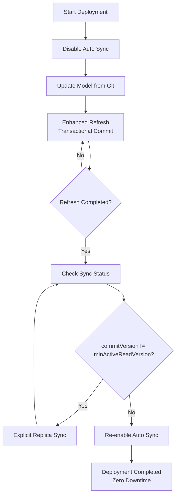

---
tags:
  - PowerBI
  - DataEngineering
  - DevOps
  - DataOps
created: 2024-12-24
description: How Query Scale Out replica control enabled zero-downtime deployments for large Power BI semantic models. A technical guide to manually controlling replica synchronization for production-safe updates.
cover: Query Scale Out (qso)/attachments/ChatGPT.png
image: Query Scale Out (qso)/attachments/ChatGPT.png
author: Muhammad Samy
---
![[Query Scale Out (qso)/attachments/ChatGPT.png]]
# Refreshing a Power BI Semantic Model Without Affecting Production

## Why This Matters

This was my first time trying **Query Scale Out (QSO) replica control**, and I don't think I'll ever roll out breaking changes to production without it again.

In our environment, we manage large semantic models. Even something as simple as adding a column to a core table usually required:

- Scheduling work outside business hours
- Monitoring long refresh cycles
- Accepting temporary risk to production users

That often meant late nights and careful monitoring until the refresh completed successfully.

---

## The Missing Piece I Didn't Know About

We already had Query Scale Out enabled, and I was tracking replica usage daily using Log Analytics:

```kusto
PowerBIDatasetsWorkspace
| where TimeGenerated > ago(30d)
| where ArtifactId == '' // add your artifact id
| extend DateFormatted = toint(format_datetime(TimeGenerated, 'yyyyMMdd'))
| where OperationName in ('QueryEnd', 'CommandEnd')
| summarize replicas = dcount(ReplicaId) by DateFormatted
```

But what I didn't realize is that I could **manually control synchronization** between:

- The read-write primary replica (**AAA**)
- The read-only replicas serving production queries

That insight completely changed how I approach deployments.

---

## From Inspiration to Immediate Action

Earlier today, I saw a LinkedIn comment mentioning that replica sync can be controlled explicitly.

When I come across new information like this, I like to test it the same day — that's how I retain what I learn.

So I designed a deployment flow using Power BI REST APIs, tested it via Postman, and validated it end to end.

---

## 🔁 Deployment Flow (Zero Downtime)

### Step 1: Disable automatic replica sync

```http
PATCH https://api.powerbi.com/v1.0/myorg/groups/:groupId/datasets/:datasetId
```

```json
{
  "queryScaleOutSettings": {
    "autoSyncReadOnlyReplicas": false
  }
}
```

### Step 2: Update model & refresh

Deploy changes from Git, then run an enhanced refresh and wait till it complete:

```http
POST https://api.powerbi.com/v1.0/myorg/groups/:groupId/datasets/:datasetId/refreshes
```

```json
{
  "type": "full",
  "retryCount": 0,
  "timeout": "05:00:00",
  "applyRefreshPolicy": false,
  "maxParallelism": 80,
  "objects": [
    { "table": "Table 1" },
    { "table": "Table 2" },
    { "table": "Table 3" }
  ],
  "commitMode": "transactional"
}
```

### Step 3: Check sync status

```http
GET https://api.powerbi.com/v1.0/myorg/groups/:groupId/datasets/:datasetId/queryScaleOut/syncStatus
```

## 📊 Understanding the Sync Status API

The `syncStatus` endpoint returns very useful metadata:

```json
{
  "commitVersion": 133186221251720662,
  "commitTimestamp": "2023-01-19T17:15:25.1720662Z",
  "targetSyncVersion": 133184583205771509,
  "targetSyncTimestamp": "2023-01-17T19:45:20.5771509Z",
  "triggerReason": "explicit",
  "syncStartTime": "2023-01-17T20:37:49.9625479Z",
  "syncEndTime": "2023-01-17T20:37:50.6029293Z",
  "minActiveReadVersion": 133184583205771509,
  "minActiveReadTimestamp": "2023-01-17T19:45:20.5771509Z",
  "scaleOutStatus": "Enabled"
}
```

### 🔑 Key Indicator

When `commitVersion != minActiveReadVersion`, your read-only replicas are out of sync with the primary model and you need to sync it manually and this means our success.

### Step 4: Explicitly sync replicas

```http
POST https://api.powerbi.com/v1.0/myorg/groups/:groupId/datasets/:datasetId/queryScaleOut/sync
```

### Step 5: Re-enable auto sync

```http
PATCH https://api.powerbi.com/v1.0/myorg/groups/:groupId/datasets/:datasetId
```

```json
{
  "queryScaleOutSettings": {
    "autoSyncReadOnlyReplicas": true
  }
}
```

**Result:** Changes deployed with zero downtime and no production impact ✅

---

You will notice if you checked the sync status it changed to explicit as the following reasons:

### Trigger Reason Values

|Value|Meaning|
|---|---|
|`explicit`|Sync manually triggered|
|`automatic`|Auto sync triggered|
|`system`|Triggered by system event|

---

## 📚 References

- [Power BI Scale-Out Overview](https://learn.microsoft.com/power-bi/enterprise/service-premium-scale-out)
- [Get Query Scale-Out Sync Status API](https://learn.microsoft.com/rest/api/power-bi/datasets/get-query-scale-out-sync-status)

---

## Deployment Flow Diagram



---

## What's Next?

I've created a complete Postman collection that automates this entire workflow, making it easy to deploy with confidence. I'll be sharing it with the community soon .

![[Pasted image 20251224160135.png]]

Stay tuned! 🚀

---

**Tags:** #PowerBI #DataEngineering #Azure #DevOps #DataOps #BusinessIntelligence

---

_Have you tried Query Scale Out for your deployments? What's your approach to zero-downtime updates? Let me know in the comments!_
